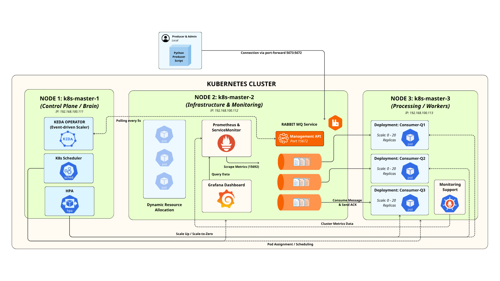

# KEDA + RabbitMQ Event-Driven Autoscaling Demo

Dự án minh họa cách sử dụng **KEDA** (Kubernetes Event-driven Autoscaling) để tự động scale các consumer Python dựa trên độ dài hàng đợi RabbitMQ.

Hệ thống bao gồm:
- RabbitMQ làm message broker với 3 queue (queue1, queue2, queue3)
- 3 Deployment consumer riêng biệt, mỗi cái lắng nghe 1 queue
- KEDA ScaledObject scale số lượng pod từ 0 → 20 dựa trên queue length (mỗi pod xử lý ~20 messages)
- Giám sát qua Prometheus + Grafana
- Script gửi message từ local với tốc độ kiểm soát (round-robin vào 3 queue)

## Architecture



## Công nghệ sử dụng
| Nhóm                 | Công nghệ chính                                      | Vai trò chính                                   |
|----------------------|------------------------------------------------------|--------------------------------------------------|
| Orchestration        | Kubernetes                                           | Quản lý container & autoscaling native          |
| Event-driven Scaling | KEDA + HPA                                           | Scale dựa trên queue length                     |
| Message Queue        | RabbitMQ (3-management + prometheus plugin)        | Lưu trữ & phân phối message                     |
| Monitoring           | Prometheus + Grafana + ServiceMonitor              | Thu thập & hiển thị metrics                     |
| Application          | Python 3.11 + pika                                  | Xử lý message (consumer)                        |
| Deployment           | Docker                                               | Build image consumer                            |

## Cấu trúc thư mục
```
KEDA/
├── scripts/
│   ├── consumer.py              # Consumer Python xử lý message từ queue
│   ├── Dockerfile               # Dockerfile build image cho consumer
│   ├── send_messages.py         # Script gửi message từ local (round-robin, điều chỉnh tốc độ)
│   ├── start-port-forward.sh    # Khởi động port-forward đến RabbitMQ
│   └── stop-port-forward.sh     # Dừng port-forward
│
├── yaml/
│   ├── consumer-deploy.yaml     # 3 Deployment consumer (q1, q2, q3)
│   ├── rabbitmq-deploy.yaml     # Deployment RabbitMQ (rabbitmq:3-management)
│   ├── rabbitmq-svc.yaml        # Service expose RabbitMQ (AMQP + Management + Metrics)
│   ├── rabbitmq-monitor.yaml    # ServiceMonitor cho Prometheus scrape metrics
│   └── scaledobject.yaml        # 3 ScaledObject KEDA cho từng queue
│
├── grafana-dashboard.json       # Dashboard Grafana (queue length, replicas, CPU/memory)
└── README.md                    # Hướng dẫn
```

## Yêu cầu trước khi bắt đầu

- Kubernetes cluster đang hoạt động (minikube, kind, EKS, GKE, v.v.)
- `kubectl` đã cấu hình đúng context
- Helm 3 đã cài đặt
- Docker đã cài đặt (để build image consumer)
- Python 3 + pip trên máy local (để chạy send_messages.py)
- Namespace `monitoring` đã có Prometheus + Grafana 

## Các bước triển khai chi tiết

### 1. Tạo namespace
```bash
kubectl create namespace messaging
```

### 2. Cài đặt KEDA
```bash
helm repo add kedacore https://kedacore.github.io/charts
helm repo update

helm install keda kedacore/keda --namespace keda --create-namespace

# Kiểm tra
kubectl get pods -n keda
```

### 3. Triển khai RabbitMQ
```bash
kubectl apply -f yaml/rabbitmq-deploy.yaml
kubectl apply -f yaml/rabbitmq-svc.yaml

# Theo dõi pod
kubectl get pods -n messaging -w
```

### 4. Cấu hình giám sát RabbitMQ (Prometheus)
```bash
kubectl apply -f yaml/rabbitmq-monitor.yaml

# Restart pod prometheus để reload targets (nếu cần)
kubectl delete pod -l app.kubernetes.io/name=prometheus -n monitoring --grace-period=0
```

### 5. Tạo 3 queue trong RabbitMQ
```bash
# Lấy tên pod RabbitMQ
RABBIT_POD=$(kubectl get pod -n messaging -l app=rabbitmq -o jsonpath="{.items[0].metadata.name}")

# Copy rabbitmqadmin (tải trước từ: https://github.com/rabbitmq/rabbitmq-management/releases)
kubectl cp rabbitmqadmin messaging/${RABBIT_POD}:/tmp/rabbitmqadmin

# Tạo queue
kubectl exec -it ${RABBIT_POD} -n messaging -- bash -c "
  chmod +x /tmp/rabbitmqadmin && \
  /tmp/rabbitmqadmin -u admin -p admin -V / declare queue name=queue1 durable=true && \
  /tmp/rabbitmqadmin -u admin -p admin -V / declare queue name=queue2 durable=true && \
  /tmp/rabbitmqadmin -u admin -p admin -V / declare queue name=queue3 durable=true && \
  /tmp/rabbitmqadmin -u admin -p admin -V / list queues
"
```

### 6. Build và push image consumer
```bash
cd scripts

# Build (thay yourusername bằng tài khoản Docker Hub của bạn)
docker build -t yourusername/rabbitmq-consumer-test:latest -f Dockerfile .

# Push
docker push yourusername/rabbitmq-consumer-test:latest
```

### 7. Triển khai Consumer Deployments
```bash
kubectl apply -f yaml/consumer-deploy.yaml

# Ban đầu sẽ có 0 pod (vì minReplicaCount=0)
kubectl get pods -n messaging
```

### 8. Triển khai KEDA ScaledObjects
```bash
kubectl apply -f yaml/scaledobject.yaml

# KEDA sẽ tự động tạo HPA
kubectl get hpa -n messaging
```

### 9. Test hệ thống
#### Mở port-forward
```bash
# Cách khuyến nghị: dùng script
chmod +x scripts/start-port-forward.sh scripts/stop-port-forward.sh
./scripts/start-port-forward.sh
```
Hoặc chạy thủ công:
```bash
kubectl port-forward svc/rabbitmq 5673:5672 -n messaging
```

#### Gửi message thử nghiệm
```bash
# Ví dụ: 10.000 message, tốc độ 2000 msg/s
python3 scripts/send_messages.py 10000 2000

# Test nhanh
python3 scripts/send_messages.py 5000 1000
```

### 10. Quan sát autoscaling (mở nhiều terminal)
#### Terminal 1 – Theo dõi pod:
```bash
watch -n 1 'kubectl get pods -n messaging | grep consumer'
```
#### Terminal 2 – Theo dõi queue length:
```bash
watch -n 2 "kubectl exec -it deployment/rabbitmq -n messaging -- rabbitmqctl list_queues name messages_ready consumers"
```
#### Terminal 3 – Theo dõi HPA:
```bash
kubectl get hpa -n messaging -w
```

### 11. Giám sát qua Grafana
Truy cập Grafana → Import → Upload JSON file → chọn grafana-dashboard.json.
Hoặc dùng dashboard ID 10991 (RabbitMQ official) và tùy chỉnh thêm panel nếu cần

## Dọn dẹp
```bash
# Xóa toàn bộ tài nguyên
kubectl delete namespace messaging

# Xóa KEDA (nếu không dùng nữa)
helm uninstall keda -n keda
kubectl delete namespace keda
```

